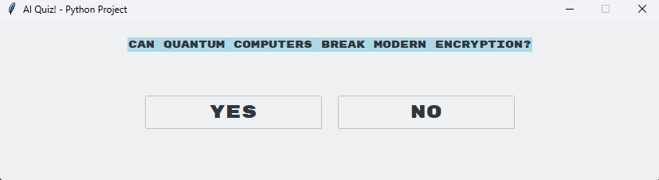

# 🤖 AI Quiz (Python)



A graphical **AI-powered Yes/No Quiz** built with Python and Tkinter.  
The program generates short, difficult technology-related questions using the OpenAI API and tracks your score over 10 rounds.

---

## ✨ Features

### AI Question Generation
- Uses OpenAI (`gpt-3.5-turbo`) to generate unique questions
- Questions are:
  - Yes/No format
  - Technology-related
  - Under **40 characters**
  - Designed to be difficult
- Automatically extracts correct answer from API response

### Game System
- 10 questions per game session
- Real-time score tracking
- Instant feedback:
  - ✅ Correct (Green background)
  - ❌ Incorrect (Red background)
- Automatic transition to next question
- Final score screen at the end
- Restart button to play again

### Graphical User Interface (GUI)
- Built with **Tkinter** and **ttkthemes**
- Theme: `"breeze"`
- Styled Yes/No buttons
- Clean centered layout
- Fixed window size
- Dynamic font resizing for feedback

---

## 🛠 Technologies Used

- **Python 3**
- **Tkinter**
- **ttkthemes**
- **OpenAI API**

---

## ▶️ How to Run

1. Make sure Python 3 is installed
2. Install dependencies:

   ```bash
   pip install openai ttkthemes
   ```

3. Replace:
   ```
   "***ENTER YOUR API KEY HERE!***"
   ```
   with your actual OpenAI API key

4. Run the program:

   ```bash
   python ai_quiz.py
   ```

---

## 📂 Required Files

- `ai_quiz.py`
- Screenshot image (e.g., `screenshot.png`) for README
- Internet connection (required for API calls)

---

## ⚠️ Notes

- Requires a valid OpenAI API key
- Internet connection required
- Questions are generated dynamically every time
- Designed for educational and API integration practice

---

## 👤 Author

**AlexIsNotInset**
